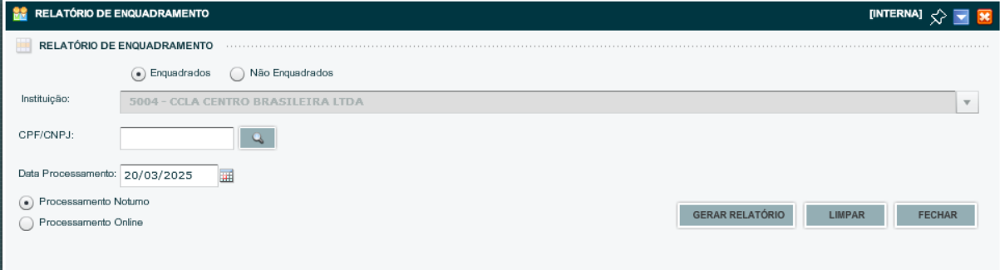

# ANÁLISE DE ENQUADRADOS DO CHEQUE ESPECIAL NA FÁBBRICA DE LIMITES

## 1. Demanda:
Demanda da Diretoria para acompanhar semanalmente as contratações de crédito ( Cheque Especial )na Fábrica de Limites. 
No primeiro e-mail enviado dia 20/03 foram apresentados os valores disponíveis para a contratação. Nos demais reportes sserá necessário o envio do comparativo de cooperados enquadrados que tiveram o limite contratado no período.

## 2. Dados
Os dados disponíveis são: O relatório de **enquadrados na fábrica de limites** expostado do Sisbr 2.0 e os dados do banco de dados. 

### passo a passo para o relatório do Sisbr 2.0

* Acessar o Sisbr 2.0
* Acessar o módulo **Plataforma de Risco de Crédito**
* Acessar **CRL - Contrle de Limites Sicoob**
* no menu superior ir em **Relatórios**
* No menu suspenso escolher **Relatório de Enquadramento**
* Por último **GERAR RELATÓRIO** 

Exemplo da tela para consulta:

O relatório será emittido no formato CSV e deverá ser anexado na pasta **"Sisbr"** neste diretório.

## 3. Executando os dados
Após anexar o arquivo do Sisbr 2.0, deverá ser executado o arquivo **consulta.py** e depois o arquivo **eda.ipynb** estes arquivos irão gerar um arquivo excel com os dados tratados na pasta **output**

### observação:
O arquivo **consulta.py**, faz a consulta SQL no banco de dados db_inteligencia-dados. sendo que o computador deverá está com acesso ao banco para a execução.

